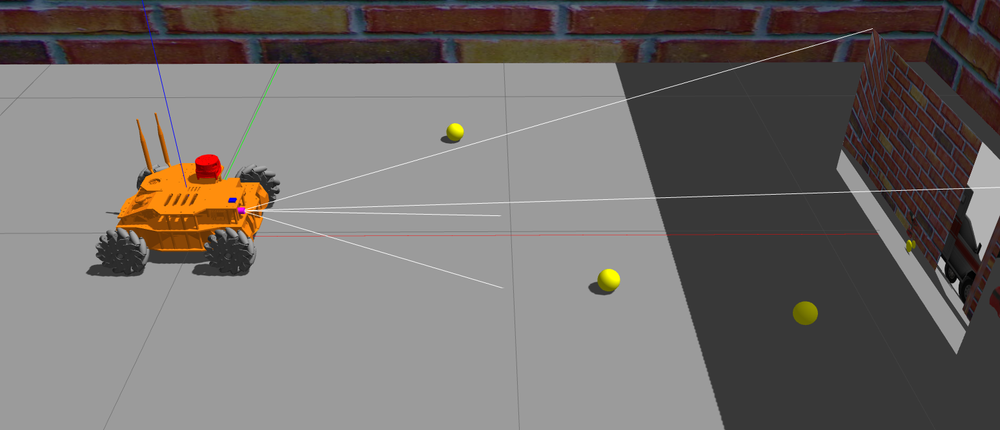
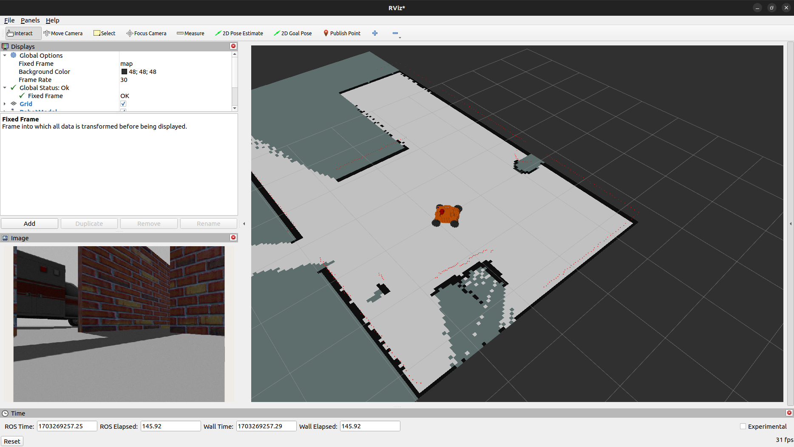

# Cerebrum Documentation

**Repository Part of Roboost Project**

This repository, a crucial segment of the Roboost project, hosts high-level functionalities of the Roboost robot in ROS2 packages. These packages are tailored for deployment on the robot's onboard computer using Docker and allow local development through a VSCode devcontainer.

**Project Information:**

- [Roboost Project Website](https://www.technologiehub.at/Roboost)
- [Roboost GitHub Organization](https://github.com/Roboost-Robotics)

## Description

The Cerebrum repository incorporates ROS2 packages essential for the operation and control of the Roboost robot. These packages integrate to manage navigation, vision processing, and other more advanced functionalities.

Here you can see the simulated robot in Gazebo:



And here the integration with slam-toolbox:



## Packages

### roboost

Core functionalities of the robot, including control, vision, and navigation.

#### Launch Files

- **camera.launch.py**: Launches the camera node.

  ```bash
  ros2 launch roboost camera.launch.py
  ```

- **joy_control.launch.py**: Activates joystick control.

  ```bash
  ros2 launch roboost joy_control.launch.py
  ```

- **mecanum_sim.launch.py**: Simulates the robot in Gazebo.

  ```bash
  ros2 launch roboost mecanum_sim.launch.py world:=src/roboost/worlds/home.world
  ```

- **mecanum_tf_broadcast.launch.py**: Publishes the robot's TF tree and URDF model.

  ```bash
  ros2 launch tf_broadcast_package mecanum_tf_broadcast_launch.py
  ```

### yolov8_ros

Integrates YOLOv8 for object detection.

#### Test Usage

- Camera stream:

  ```bash
  ros2 launch roboost camera.launch.py
  ```

- YOLOv8 node:

  ```bash
  ros2 launch yolov8_bringup yolov8.launch.py device:=cpu input_image_topic:=/image_raw
  ```

### slam-toolbox

For mapping and localization using SLAM.

#### Launching

- Start mapping:

  ```bash
  ros2 launch slam_toolbox online_async_launch.py params_file:=./src/roboost/config/mapper_params_online_async.yaml
  ```

## Installation

TODO: Add more detailed instructions, including config and launch files.

### Prerequisites

- [VSCode](https://code.visualstudio.com/)
- [Docker](https://www.docker.com/)

### Building and Deployment

- Clone the repository.
- Open in VSCode.
- Use Docker for building and deployment:
  - Build the Docker image:
```bash
docker build -t roboost-cerebrum .
```
  - Run a container from the image:
```bash
docker run -it --rm --name cerebrum_container roboost-cerebrum
```

  - Inside the container, navigate to the workspace and build the ROS2 packages:

```bash
colcon build
source install/setup.bash
```

Launch the desired ROS2 nodes using the launch files provided in the documentation.

## Usage

Control and monitor the robot via ROS2 commands. Specific instructions in each package's documentation.

## Additional Components (Planned)

- ChatGPT integration
- Speech recognition and synthesis
- NAV2 stack implementation

---

# Roboost Cortex - Packages

Informed by resources like [Articulated Robotics](https://www.youtube.com/watch?v=CwdbsvcpOHM&ab_channel=ArticulatedRobotics), this section covers the installation and usage of various packages.

## Installation

In the workspace root:

```bash
rosdep install -i --from-path src --rosdistro humble -y
colcon build
source install/local_setup.bash
```

## Packages Overview

Refer to the above sections for detailed package descriptions and usage instructions.

## Future Enhancements

- MoveIt implementation.
- Vision stack expansion.
- Additional documentation.
